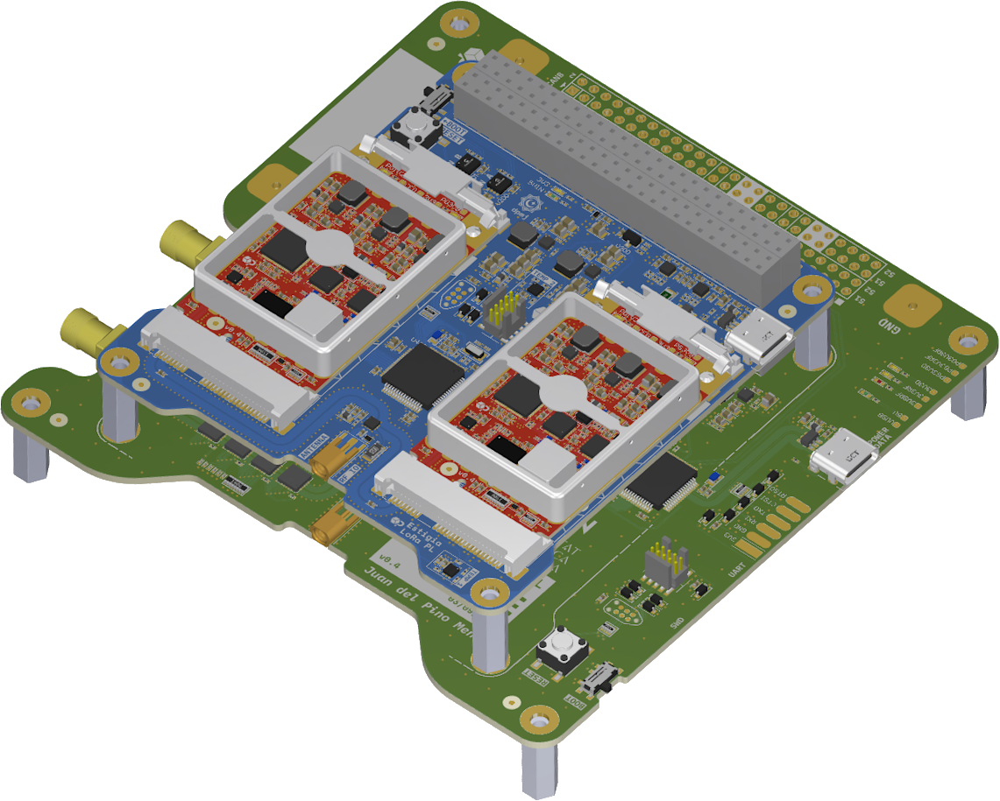

# Hardware design of a LoRa Gateway payload for CubeSat.

This repository contains the hardware design files from my first Master's Thesis in Electronic Systems Engineering at the Polytechnic University of Valencia, Spain, 2024. The thesis covers developing a LoRa communications payload for a CubeSat in Low Earth Orbit (LEO). The payload consists of two mPCIe LoRa gateway modules and a CubeSat-PC/104 motherboard, which serves as the electrical and mechanical interface with the rest of the satellite. An Electrical Ground Support Equipment (EGSE) auxiliary board provides test hardware for the payload by emulating interaction with the CubeSat. It also acts as a LoRa end-device to test the performance of the communications system.

This project has been superseded and continued in my other master's thesis: [Hardware design of a LoRa Gateway and in-orbit computing payload for CubeSat](https://github.com/dpmj/Master_Thesis_LoRa_Gateway_and_Computing_CubeSat_Payload_hardware).

Third-party desing elements included in this repository are subject to the copyright of their respective owners.

```bibtex
@phdthesis{dpmj-master-thesis-2024,
    author = {{Del Pino Mena}, Juan},
    title = {Development of a {LoRa}-based communications payload for {CubeSat}},
    school = {Universitat Politècnica de València},
    year = {2024},
    month = {9},
    address = {València, Spain},
    type = {Master's thesis},
    url = {https://riunet.upv.es/handle/10251/209572},
    doi = {https://doi.org/10.5281/zenodo.13935118}
}
```


